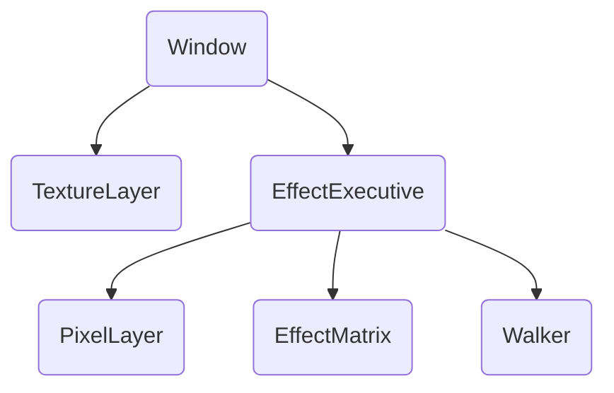
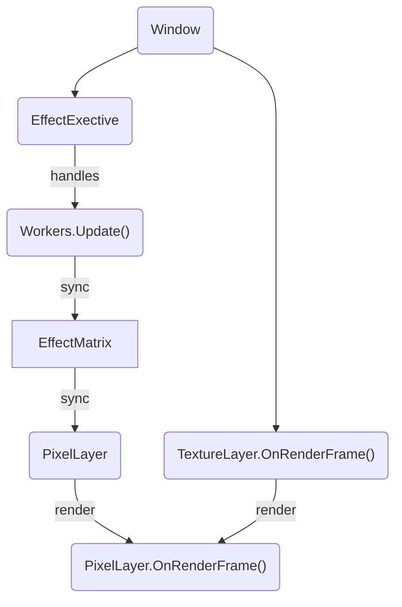

# vapour Docs

## Directory

| directory | description |
| :-------- | :---------- |
| `parts/` | core components, base classes |
| `layers/` | shaders |
| `effects/` | created effects go here |
| `utils/` | utility functions |

## Overview

### Structure

- `Window` manages the OpenTK rendering engine.
  - The picture is stored in a `TextureLayer`.
  - The effect is stored in an `EffectExecutive` object.
  - During rendering, the picture is rendered, then the effect on top of it.
- The `EffectExecutive` manages processing the effect each frame.
  - It stores the vertices to be rendered in a `PixelLayer`.
  - It stores the visual data of each vertex in an `EffectMatrix<T>`.
    - `<T>` is the data value associated with each pixel, such as brightness, transparency, and/or colour.
  - It also manages other workers that are part of generating the effect, such as `Walker` objects for random walking, etc.
- During processing, the `EffectExecutive` calls `.Update()` on its workers, updates the `EffectMatrix` accordingly, and then syncs the modification with the `PixelLayer` for rendering.

### Pipeline

- `Window` calls `.Update()` on its `EffectExecutive`.
- `EffectExecutive` calls `.Update()` on its workers.
- The pixels in `EffectMatrix` are updated.
- The vertices in `PixelLayer` are updated to reflect those changes.
- `Window` calls `.OnRenderFrame()` on its `TextureLayer`, rendering the picture.
- `Window` calls `.OnRenderFrame()` on its `EffectExecutive.PixelLayer`, overlaying the effect onto the picture.
